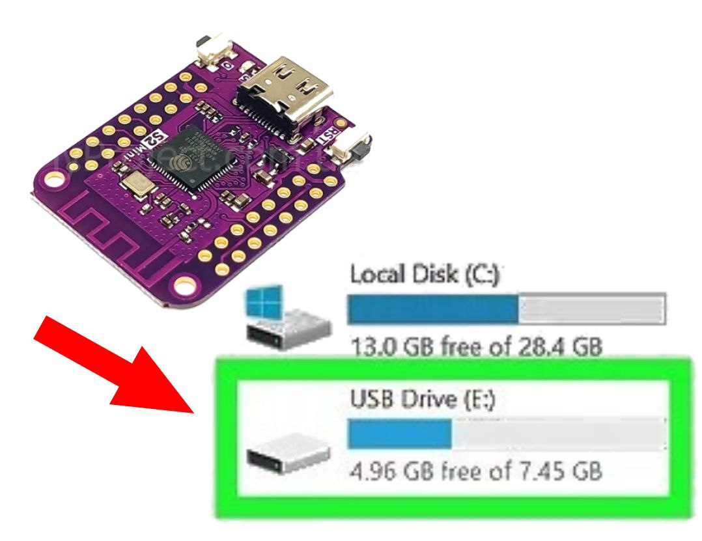

# ESP32 MSC to SPI Flash demo

This code makes **1MB working Flash drive from ESP32-S2**.     
How it works:     
https://youtu.be/wCQvbELoyOI     
   
   

**Here's the point:**     
MSC Is access memory by LBA num and Offset.      
LBA=512bytes.     
but     
Flash chip is accessed by pages. And before every WRITE, there's necessary to CLEAR all corresponding page.     
Page = 4096 bytes.     
     

How to make USB flash drive from ESP32-S2?     
ESP32-S2 USB MSC to SPI Flash Demo     
This example shows:     
1) How to get partition      
2) How to read directly from partition      
3) How to write directly to partition      
4) How to initialize USB MSC protocol     
5) How to convert LBA-based access requests from USB to pages-based access to SPI Flash      
6) How to build and connect my example      
7) How to format and use this drive     